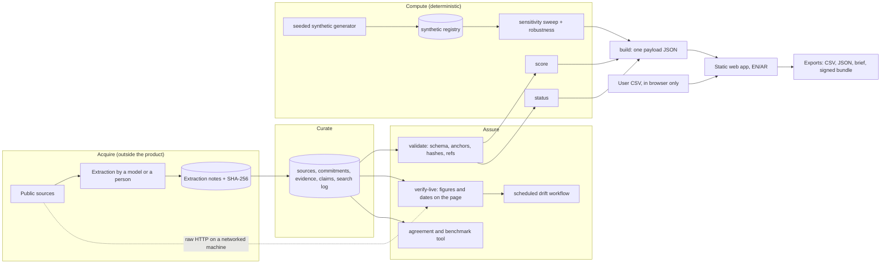

# System architecture

## 1. Principles
- Static core. No runtime model, no runtime network call, no secrets. The browser is the only runtime.
- One source of truth for rules: Python is the reference. TypeScript mirrors only what the browser must recompute, and a golden file keeps them identical.
- Every claim traces to a source, a date and a check. Every number on screen can be recomputed from files in the repository.
- Real and synthetic data never share a number.

## 2. Data flow

## 3. Components

| Component | Where | Responsibility | Depends on |
|---|---|---|---|
| Schemas | `pipeline/schemas.py` | The contract for every record. Synthetic flag is a literal true | pydantic |
| Validator | `pipeline/validate.py` | Integrity: references, anchors, hashes, source-kind rules | schemas |
| Live verifier | `pipeline/verify_live.py` | Fetch each URL and check expected figures and dates on the raw page | network, stdlib only |
| Scoring | `pipeline/score.py` | Six checks per commitment, bands | schemas |
| Status | `pipeline/status.py` | Neutral-by-default status, evidence eligibility | schemas |
| Synthetic generator | `pipeline/synth.py` | Seeded labelled registry, scenario presets | none |
| Sensitivity | `pipeline/sensitivity.py` | 72-definition sweep, robustness, variance decomposition | synthetic |
| Eval tools | `pipeline/evaluate.py` | Agreement between two extractions, bootstrap intervals | stdlib |
| Builder | `pipeline/__main__.py` | One payload for the site | all above |
| Engine mirror | `site/src/engine.ts` | Recompute sweep on user data in the browser | golden file |
| App | `site/src` | Pages, i18n, exports, local workspace | payload |

## 4. Deployment profiles

| Profile | Shape | Network | Who |
|---|---|---|---|
| A. Public demo | Static site on a CDN | Public | Anyone; synthetic and public data only |
| B. Office intranet | The same static build served inside the network, fonts and assets self-hosted | None outbound | An analyst team with its own service inventory (CSV stays in the browser) |
| C. Team service (design only) | API plus database in a sovereign cloud region, single sign-on, review workflow, audit log; the static app is its client | Internal | An office with several reviewers and many entities |

Profile C keeps the same schemas, the same engines and the same payload format. What it adds: identity, persistence, review states for each evidence item, an append-only audit log, scheduled live verification, and entity-level access control.

## 5. Trust boundaries and threats (summary; full table in `docs/THREAT_MODEL.md` after round 2)
- User CSV: parsed in the browser, never transmitted. Threat: malformed or hostile files. Mitigation: strict parser, size cap, no formula evaluation, no HTML injection (React escapes).
- Source pages: treated as untrusted data. Threat: a page changes or is replaced. Mitigation: figure-token checks, drift workflow, hashes of notes.
- Supply chain: pinned and locked dependencies, SBOM, audit in CI.
- Hosting: strict CSP, no third-party requests, no cookies.
